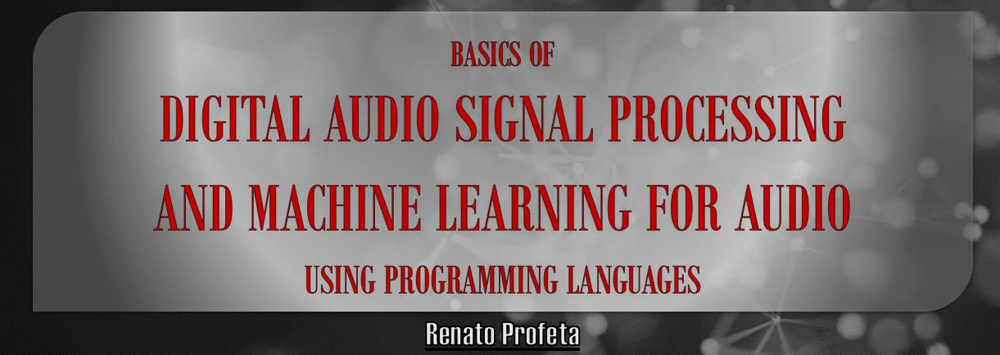

# Basics of Digital Audio Signal Processing and Machine Learning using Python
Renato Profeta

    

This is a from zero to hero series in which we learn DSP and Machine Learning theory side-by-side with learning Python Programming.
No background or previous knowledge is necessary but if you know some higher level maths it would help.
If you are just interested in the theory you can skip the programming parts, and vice-versa.
This series is very practical as we start with a code example, we explore the theory behind it and go through the code to understand the Python language.

## YouTube Playlist
 
 
 ## Content
  - Introduction: 
